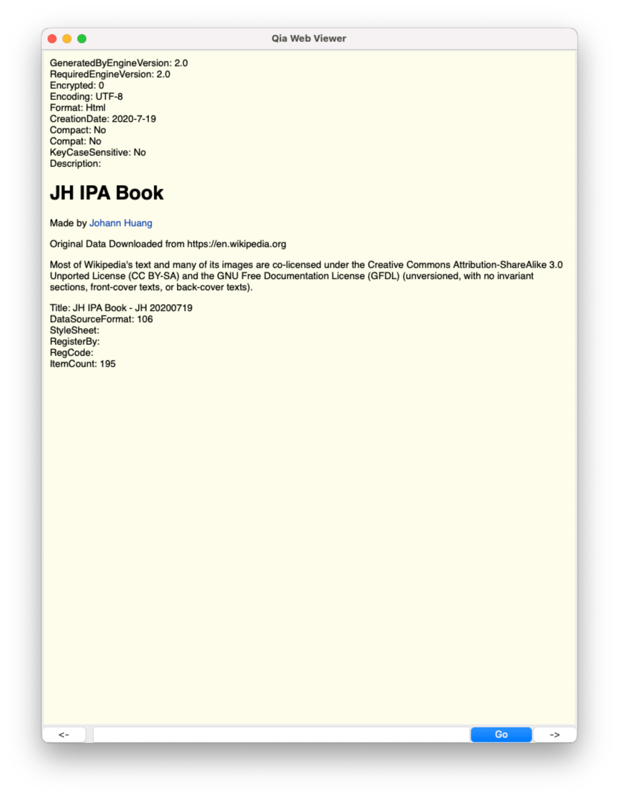
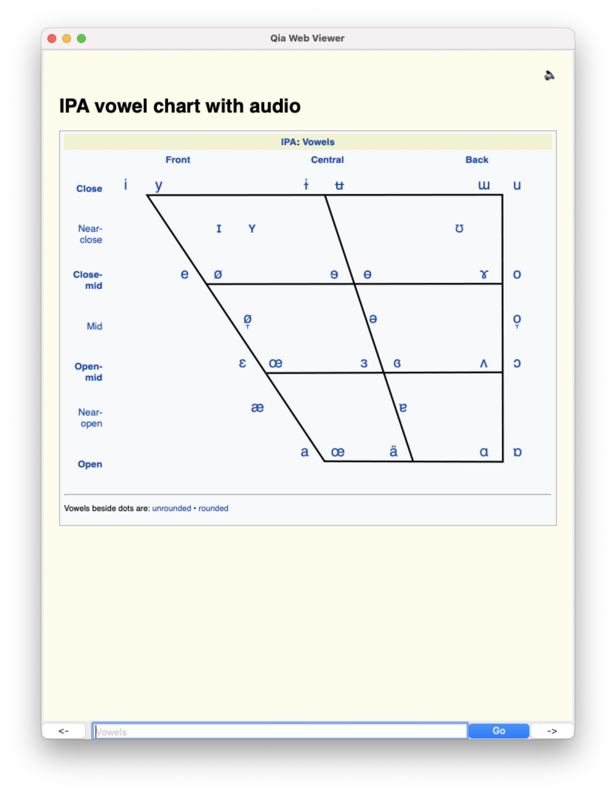
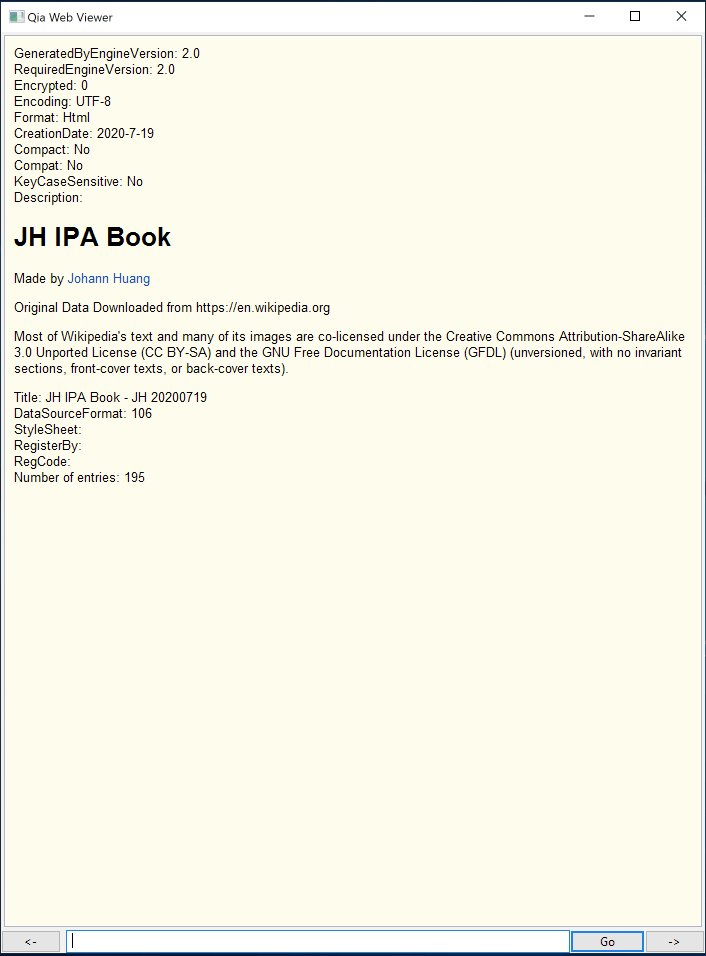
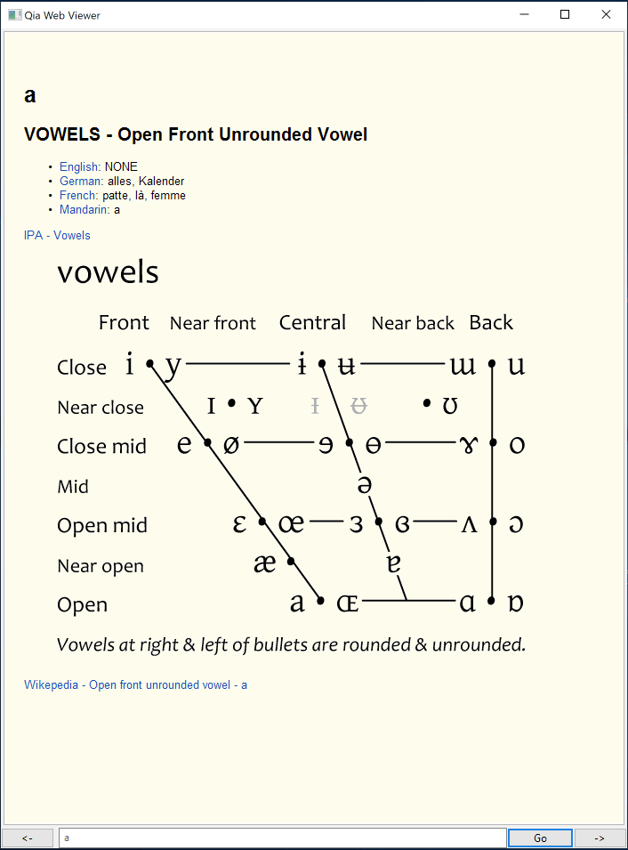
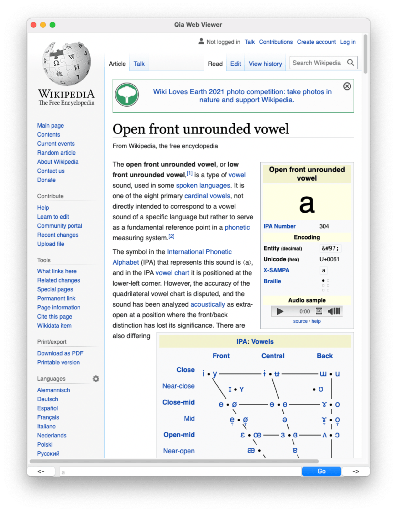

# Qia mdx Reader - WxPython Version

Maintenance
{: .label .label-blue }

Qia mdx Reader version 1 or WxPython version is an desktop GUI application which runs on macOS, Windows and Linux (where Python and WxPython can run).

The GUI application also contains a CLI as text input as shown at the bottom middle on the following screenshots.

User interface components and user experience considerations are explained in seperate child pages.

## Specialties

When more and more applications become niches which lock data, Qia mdx Reader is an application which seperates itself from data. Double click on a data file, i.e., a mdx file, Qia mdx Reader loads and reads it. (Yes, I like application and data seperation.)

## Screenshots

