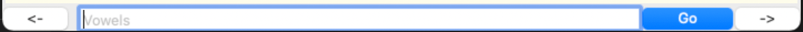
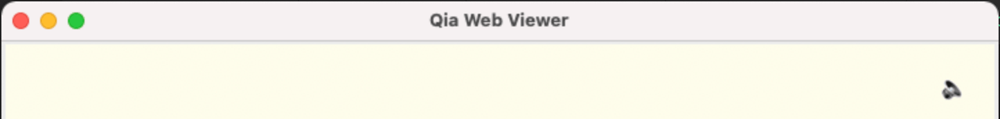

# Controls

## Controls on Application

As can be seen on the screenshot above, there are 3 buttons and 1 text input.

* The button at bottom left corner with lable “<-“ is the back button which can be used to navigate to the previous page.
* The button at bottom right corner with lable “->” is the next button which can be use to navigate to the next page.
* The button in blue background with lable “Go” to the left of the next button is the go button which submits user input in the input.
* The text input in the middle is in fact a multi-functional control.
  * it accepts key strokes
  * when it is not filled with charactors
    * it shows the keyword address of current page
    * it accepts left and right arrow keys just as cliking on the back and next button
    * it accepts Enter key as the command to return to page at stack position top (external pages (not saved in mdx file) displayed in main area don't enter the stack)
    * it accepts other keyboard shortcuts and sends received shortcuts to the currently loaded page
      * keyboard shortcuts are explained in the page of "Keyboard Shortcuts".
  * when it is filled with charactors
    * upon Enter key stroke or click on the go button, the charactors in the input is submitted as a command as explained in the page of "Commands".

## Controls in Page

As shown on the above screenshot, there is a sound speaker icon. It is in fact a play button to playout all audio found in the currently loaded page if there is any. (On pages where there is no audio found, there will be no this icon.)

Besides, there is also a invisible control in page, which accepts keyboard shortcuts just as the text input control does, and some shortcuts are send to the application.

As already mentioned above, keyboard shortcuts are explained in another page.
