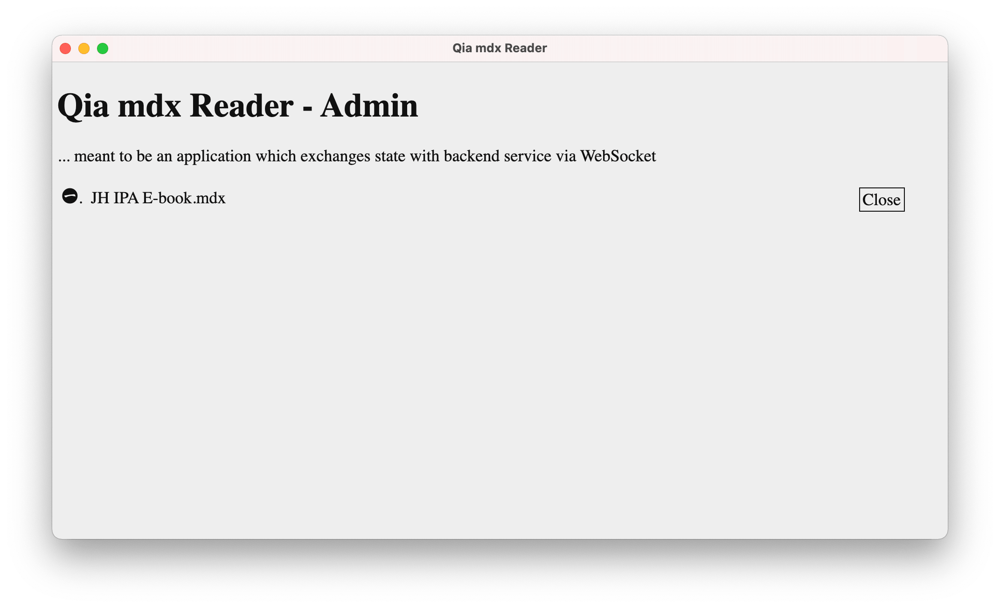
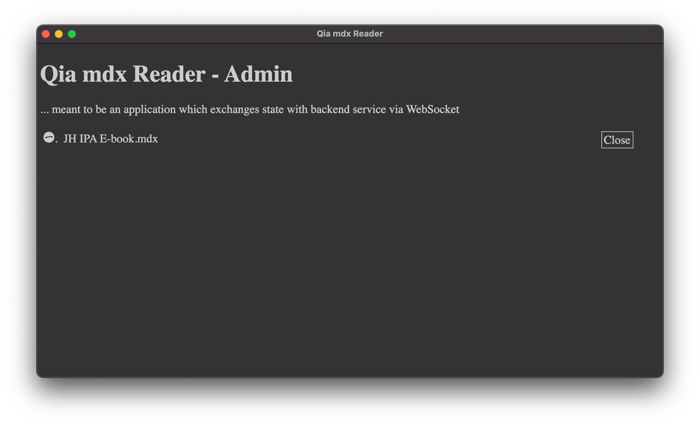
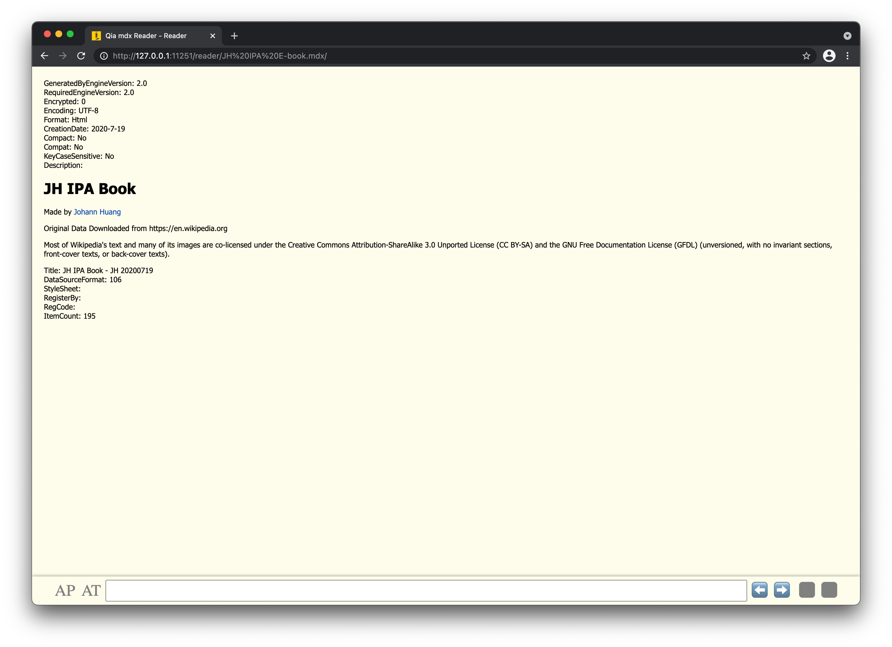
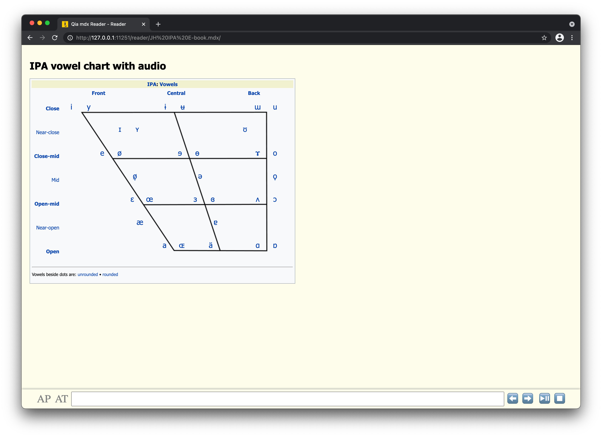

# Qia mdx Reader - Launcher, Browser and Server Version

Work in process
{: .label .label-yellow }

Qia mdx Reader version 2 is made of an architecture which can be described as launcher, browser and server. By having a launcher aside the classic BS architecture, Qia mdx Reader is also a file-based application which means (1) double-clicking on a file, (2) drag-ing'n'drop-ing a file, and (3) selecting a file from file dialog are all supported to open the file in Qia mdx Reader.

Qia mdx Reader supports

* GUI including lables and buttons
* CLI including several special leading charactors
* Keyboard shortcuts

## Screenshots

