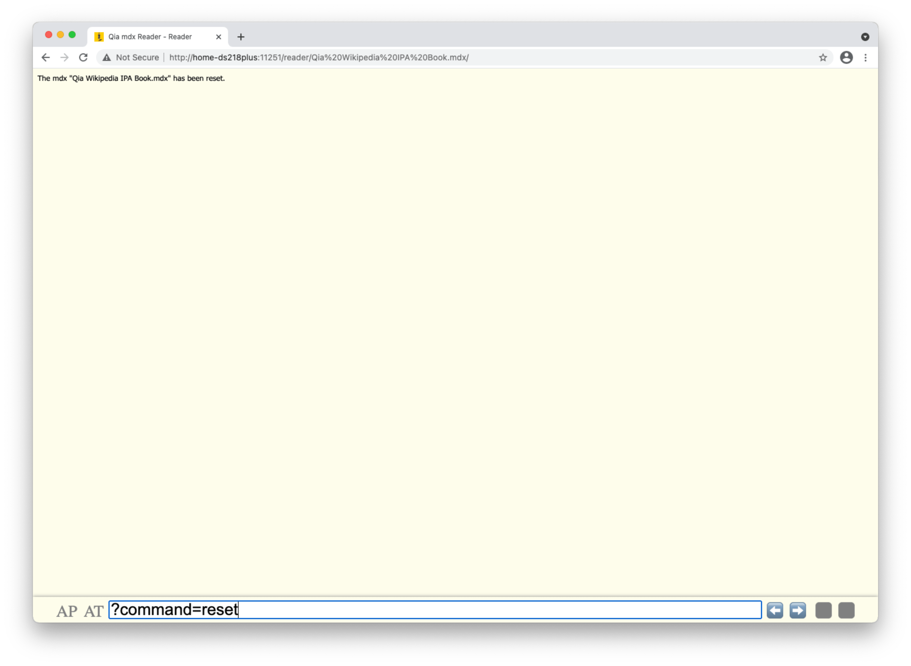
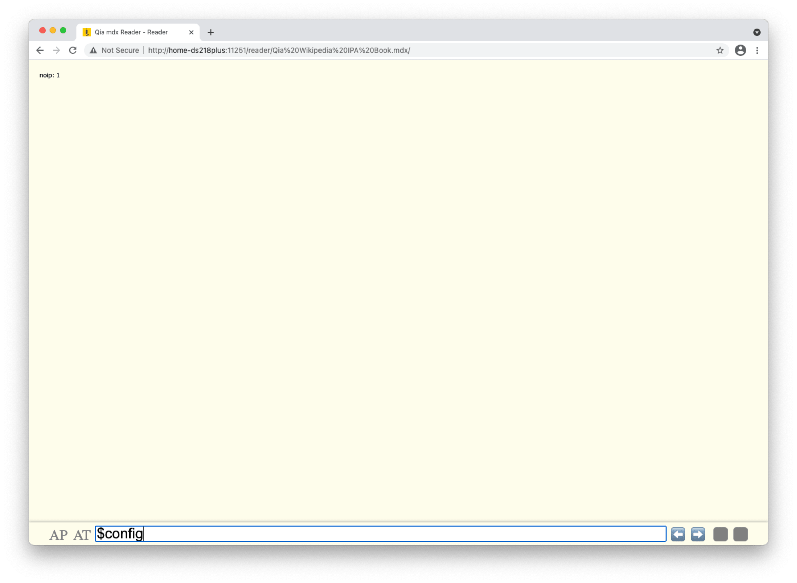
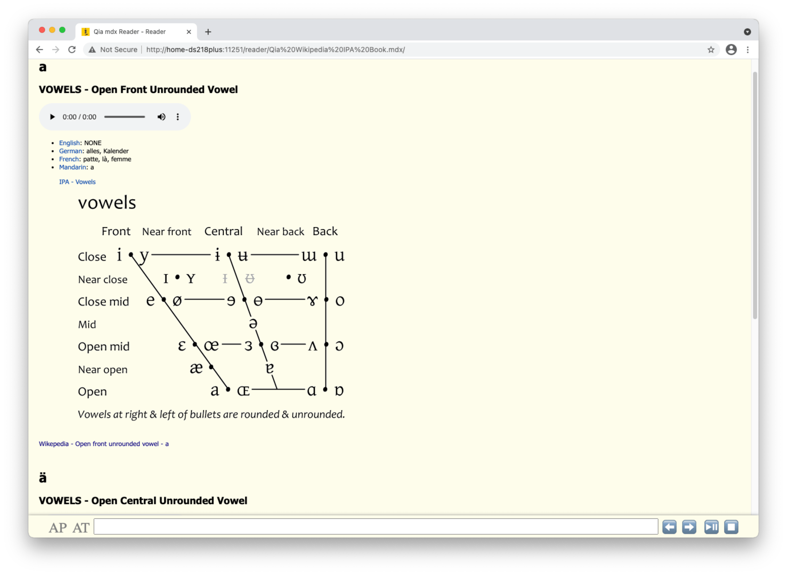
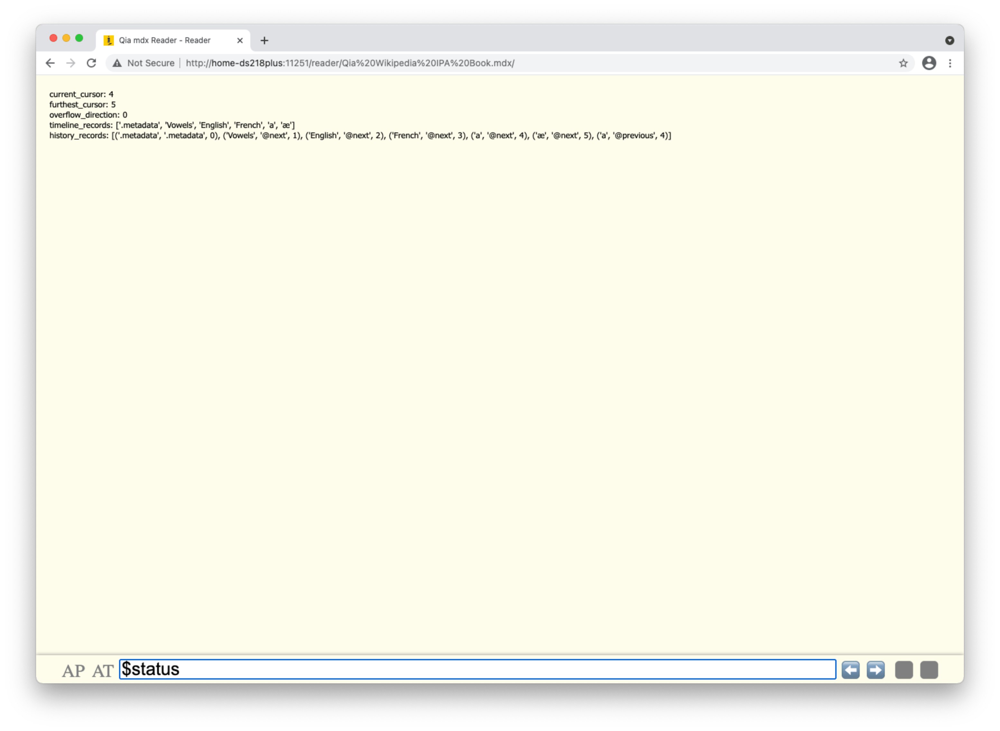

# Commands

As mentioned in Controls page, the command line interface control receives command line inputs from keyboard.

The are in general two categories of commands: the ones led by special charactor and the ones not. The ones which are not led by special charactor are just keyword for doing a dictionary search and match.

Commands can also be grouped by special leading charactors as the following.

* `?` is application level command leading charactor
  * it is just the standard thing of URL supported by Qia mdx Reader server
  * currently only one query is supported
    * `?command=reset` means reset the state of the corresponding mdx book
* `#` is the content page level command leading charactor
  * it is just the standard thing of web browser to target an element with the `id` after the `#`
* `.` is the mdx book level command leading charactor
  * `.metadata` means getting the metadata of the corresponding mdx book
* `@` is the mdx book level command leading charator - commands in this group are about page navigation
  * `@current` means getting current page in timeline records
  * `@previous` means getting previous page in timeline records
  * `@next` means getting next page in timeline records if any or getting next new page and append to timeline
  * `@#` means getting #-th page after the first in timeline records (+# at -1)
  * `@-#` means getting #-th page before the last in timeline records (-# at 1)
  * `@` means getting the last records in timeline records (0 at 1)
  * `@-=#` (# means digit(s)) means gettings #-th page before current in timeline records (-# at 0)
  * `@+=#` means getting #-th page after current in timeline records (+# at 0)
* `$` is the mdx book level command leadning charactor - commands in this group are about book configuration
  * `$config` shows current configurations
    * `$config[key]=value` or `$key=value` sets the value of configuration item with key
      * `$config[noip]=3` or `$noip=3` means showing 3 entry items per content page
  * `$status` shows current status about timeline records (current page is at which position of the timeline records)

## Screenshots

![$config[noip]=2](../images/20210612-224251.png)

