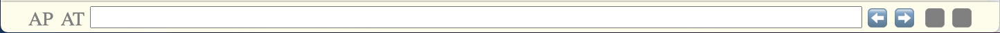
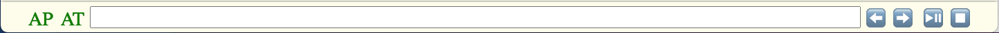

# Controls

One design difference between Qia mdx Reader version 1 and version 2 is that the version 2 doesn't have any control in the content page to have a clear separation between application and content.

As described in the Functionalities page, controls from left to right can be grouped into the following.

* left magic corner: double click to go to page top
* toggleable state indicator labels
  * AP: autoplay
  * AT: autotransition
* command line interface
* functional buttons
  * ⬅️: go to previous page
  * ➡️: go to next page
  * ⏯️: play or pause audio on the page
  * ⏹️: stop audio on the page
* right magic corner: double click to go to page bottom

## Controls

### Left magic corner

Currently, there is just one functionality linked to the left magic corner, which is scrolling the content page to the top when a user double clicks on the left magic corner.

### Right magic corner

Currently, the only functionality linked to the right magic corner is just the opposite of that to the left magic corner, which is scrolling the content page to the bottom when a user double clicks on the right magic corner.

### Toggleable state indicator labels

Except for the two magic corner, one design idea of Qia mdx Reader is to have labels at the left and buttons at the right. Labels are meant to show the current state and buttons are meant to show the action to make or the next state.

Being clear about the above difference about labels and buttons, then the difference between toggleable labels and functional buttons would also be clear.

Currently, there are two toggleable lables - AP (autoplay) and AT (autotransition).

The AP label indicates whether all audio files on a content page are automatically played-out one after another after the page is loaded by Qia mdx Reader. 
The AT label indicates whether the next content page is automatically loaded after all audio files on the current page are played-out. As the two pieces of description indicates, the autotransition depends on the auto-play. (although currently, there is no limitation to disable switching on autotransition when autoplay is off.)

Toggleable means the state of autoplay and autotransition can be switched on and off by clicking on the label. As the above two screenshots show: when autoplay or autotransition is off, the label is grey; when autoplay or autotransition is on, the lable is green.

### Functional buttons

Currently, there are four functional buttons - ⬅️, ➡️, ⏯️ and ⏹️. The first two buttons are about inter-page navigation and the last two are about inner-page audio playout.

Good buttons should have clear labels. Fortunitely, in 2021, unicode emoji are well supported by browsers. The the name of the emoji indicate:

* ⬅️ left arrow means go left and usually in reading contenxt go left means go to the previous page
* ➡️ right arrow means go right and usually in reading contenxt go right means go to the next page
* ⏯️ play or pause button means either play or pause the audio on the page
* ⏹️ stop button means stop the audio on the page

One design idea here is I want to have buttons like the hardware buttons on old machines, therefore, the button lable never changes / is stable / doesn't adapt to the current state. (so the ⏯️ is not ▶️ when no audio is playing plus ⏸️ when some audio is playing) However, in order to reduce confusion in terms of applicability, buttons are disabled as grey box when not applicable. (so as shown by the two above screenshots, the two audio playout buttons can be grey boxes when the current page has no audio; although currenlty the two inter-page navigation buttons are never disable but with content page notification when not applicable any longer) And by the way, I somehow like classical things, just like the machanical buttons, the toggleable labels are also just like the designed area of an LED display, they are toggled on when of that state and off when not.

### Command line interface

This control is the very special control on the console, it generally accepts user's keyboard inputs and does something accordingly. The keyboard inputs include keyboard shortcuts and also command lines. Because of the specialty and complexity, the keyboard shortcuts and command lines supported by this CLI control are covered in separate pages as Keyboard Shortcuts and Commands.
