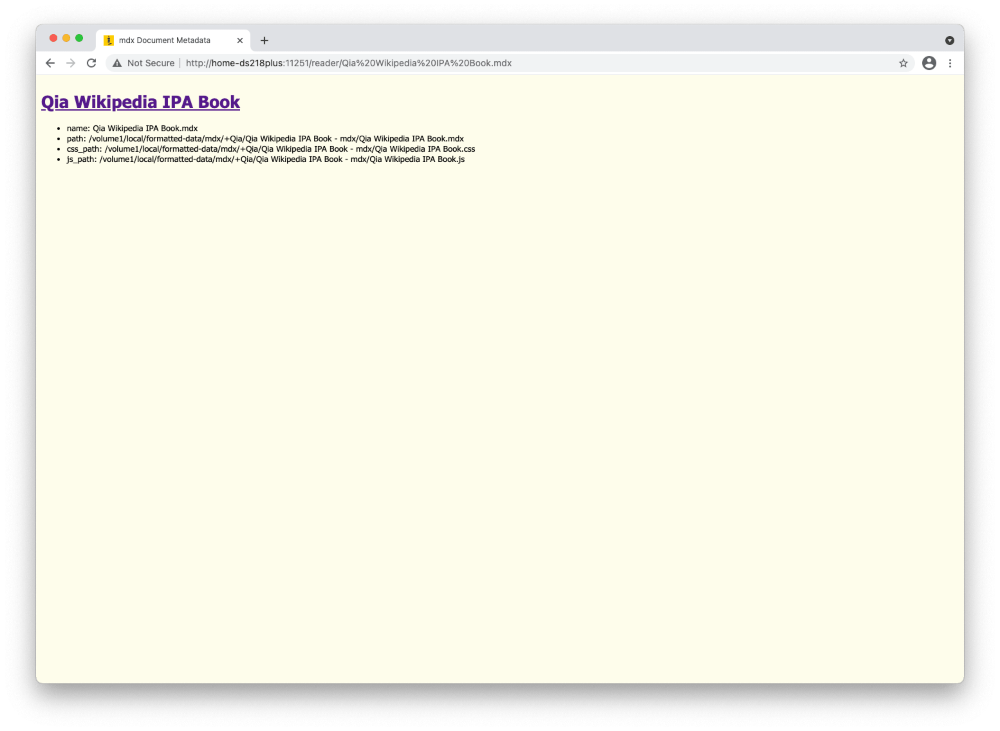

# Functionalities

Comparing to Version 1, Version 2 of Qia mdx Reader has more GUI controls and also many other enriched GUI and CLI elements.


## Opening and Closing mdx Files

### via Launcher


With a seperate launcher, there are 3 ways to open a mdx file by Qia mdx Reader.

1. double-clicking on a file 
2. drag-ing'n'drop-ing a file
3. selecting a file from file dialog

The launcher is also being called as the admin console of Qia mdx Reader by design. It lists all opened mdx files in a specifictly designed list with Chinese charactor numerals as leading number and a close button at the end of each item.

As the name of the close button indicates, by clicking on the close button, the corresponding mdx file gets closed by the Qia mdx Reader server.

By the way, worth mentioning, as a modern application, Qia mdx Reader launcher also has two themes - dark and light, which follows the system theme setting.

### via Server

Although it is not designed for typical usage, but it does exist, more or less for advance usages.

Starting the Qia mdx Reader server can be done via the following command lines.

```sh
python3 launcher.py
python3 launcher.py path_to_mdx_file_one.mdx
# NOTE: also supports two or more mdx file paths
python3 launcher.py path_to_mdx_file_one.mdx path_to_mdx_file_two.mdx
```

*About the two launchers of Qia mdx Reader: Don't get confused, the `launcher.py` is the luancher of Qia mdx Server implemented in Python while the Qia mdx Reader launcher is implemented on Electron in HTML, CSS and JavaScript.*

In the above 3 command lines, 

* the first line simply means start Qia mdx Reader server without open any mdx file
* the second and the third both mean Qia mdx Reader server can be started and instructed to open mdx files after started

Since Qia mdx Reader server is a HTTP and WebSocket server application and starting it occupies ports exclusively and by design cannot be started twice, what happens if Qia mdx Reader server has already started before executing any of the above command lines? The launching command line simply tells the running Qia mdx Reader server to open the supplied mdx files if any and if not opened yet.

In summary, run `python3 launcher.py` with appended mdx file paths also opens the mdx files, no matter whether the Qia mdx Reader is currently running or not.


## Reading mdx Files

Whether by clicking or dragging the URL to a web browser in the launcher list or directly visiting URL as `http://localhost:11251/reader/` in a web browser and then clicking on the URL, users can open a mdx e-book in the chosen web browser.



As shown in the above screenshot, the first page of the opened mdx e-book lists the files in use. Here, the mdx file also has CSS and JavaScript files aside. By clicking on the header link, users can start reading the mdx book content.


*About the mdx book used for demonstration: Don't get confused, "Qia Wikipedia IPA Book" is the file name and "JH IPA Book" is the book name. They are not unified, because I deciced to use the new name "Qia Wikipedia IPA Book" for this book some days before, but not yet re-compiled the mdx file using the new name therefore the old name "JH IPA Book" stays in the content.*

*About the screenshot used for demonstration: Don't get confused. If you are very attentive, you may have noticed the URL and web browser frame color on the screenshots of JH IPA Book don't match. It is because I am reusing the screenshots taken at night some days ago before I decided to change the file name of my IPA Book.*


There is again a metadata page, but it is already the book content, kind of like the book cover.

In order to illustrate better, I will use the following real content screenshot as the reference.


Except the web browser elements, the screenshots contains a web page area which is of somehow yellow background. The web page area is composed of two sub-areas. At the top is the page content area and at bottom is the console area. The page content area is just as every other web page, anything allowed in a typical web page is also allow in this page content area. The console area is the application specific area. 

On the console, for left to right there are the following several groups of controls.

* left magic corner: double click to go to page top
* toggleable state indicator labels
  * AP: autoplay
  * AT: autotransition
* command line interface
* functional buttons
  * ⬅️: go to previous page
  * ➡️: go to next page
  * ⏯️: play or pause audio on the page
  * ⏹️: stop audio on the page
* right magic corner: double click to go to page bottom

Just as the names of the above described controls indicate, Qia mdx Reader is capable to do the following for users:

* navigate between pages by using functional buttons or via CLI
* control the playout of audio on the page by using functional buttons
* with or without autoplay of audio on the page or autotransition from one page to the next toggleable and indicated by state indicator lables
* easy in page navigation by using the two magic corners

With the help of CLI and shortcuts, the above mentioned functionalities of Qia mdx Reader can even be of more ease. Further details are given in seperate pages as Controls, Keyboard Shortcuts and Commands.
